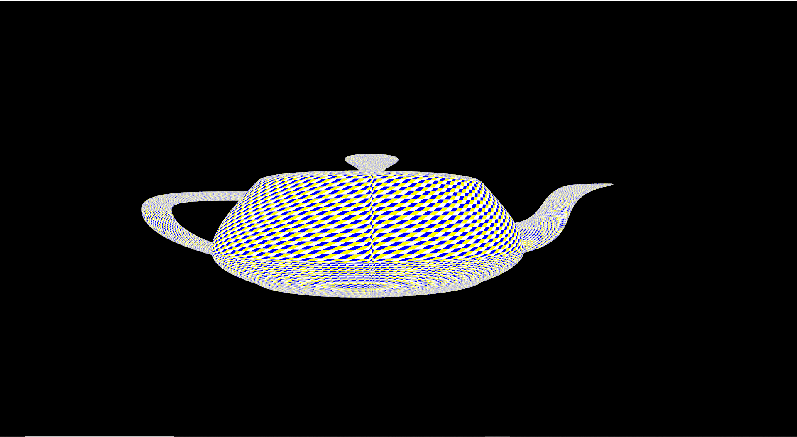

## Glorious Utah teapot

<p align=center>
    
</p>
<p align=center>
    <sub>Thats it, the entirety of the renderer... But! You can try to walk into the teapot </sub>
</p>


This repository contains a VERY basic vulkan renderer based on the following tutorial: https://vulkan-tutorial.com/Introduction

Everything related to 3D was written from scratch, thanks to https://www.scratchapixel.com

## Build instructions(Windows)
1) download vulkan sdk
2) download glfw, then create GLFW_HEADER_PATH and GLFW_STATIC_LIB_PATH sysytem or shell variables, pointing to glfw/include and the directory containing libglfw3.a respectively 
3) ```console
    mkdir build
    mkdir shaders_out
    make
   ```

